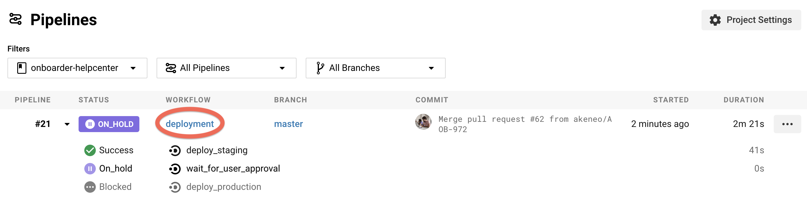
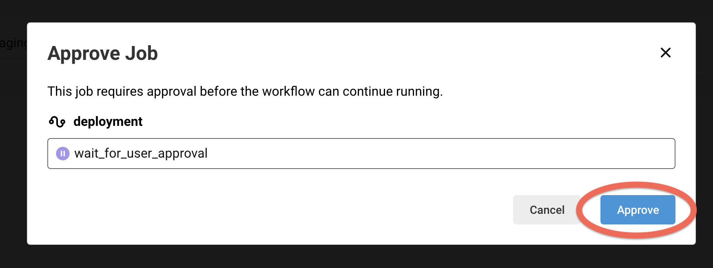

# Akeneo Onboarder Help center
This repository holds the sources for the Onboarder help center, made by hand with love.

## Install/preview the help center

Install [Docker Engine](https://docs.docker.com/engine/installation/)

### Build with docker

**/!\ Mac OS specific /!\\** Docker bind-mounts files and folder using the user and group IDs of your container, not
those of you host like on Linux. To have a working environment, export the following environment variable
```bash
$ export ONBOARDER_ON_MACOS=1
```

```bash
$ make build
```

This is only building the documentation. The documentation is not available with this command, as it does not launch the HTTP server.

### Build and launch HTTP server with docker

```bash
$ make watch
```

The help center website is then available on `http://localhost:8000/onboarder/`.
Files located in the content and src directories are watched for changes, so when developing or writing new articles you do not need to launch any other task.

### Automatic

Once you merge a PR into the `master` branch, it is automatically deployed on the staging server. You have nothing to do.

Then, you can check that your changes have been correctly applied. 

If everything went as expected, you can deploy on the production server by following the next steps:

[look at the latest merge in master](https://app.circleci.com/pipelines/github/akeneo/onboarder-helpcenter?branch=master) and click on _deployment_.



Then click on _wait_for_user_approval_.
 


Last, click on _Approve_.



### Manual

In case you want to redeploy the Onboarder documentation, [look at the latest merge in master](https://app.circleci.com/pipelines/github/akeneo/onboarder-helpcenter?branch=master) and click on _deployment_.


/!\ You have to Approve or Cancel the `wait_for_approval` step before running the job again /!\ 

Then click on _Rerun_.


## Documentation contribution

It's right [here](https://github.com/akeneo/pim-helpcenter/wiki).
