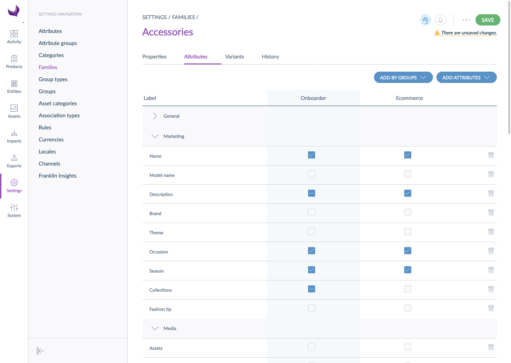

# Define assets to collect

As defined in [define product requirements](./define-product-requirements.html), you can define the assets requirements for your suppliers like for any other PIM channel. You'll be able to add asset collections that will be enriched by suppliers like any other attributes.

::: success
Asset collections identified as 'required' are the only ones taken into account for the completeness of products. The nice-to-have assets are not mandatory to synchronize the product.
:::

# Limitations
## Media file as main media
Suppliers can only share assets belonging to an asset family if their main media is a media file attribute, and not a media link one. So, asset collections linked to asset families where the main media is a media file attribute can be selected for the Onboarder channel.

::: warning
If the attribute used as the main media of the asset family linked to this asset collection is a media link attribute, the collection won't be synchronized on the supplier's end and they won't be able to send the assets.
:::

## Asset code uniqueness
As many suppliers could enrich the same asset collection and they can set the same asset code, the Onboarder sets constraints to suppliers to guarantee the uniqueness of asset codes among all your suppliers.
* A supplier can't create an asset code
* The asset code is automatically generated using a UUID

::: info
The unique code will be visible in the Asset Library but you still can [change the asset label](https://help.akeneo.com/pim/serenity/articles/work-on-your-assets.html).
:::
