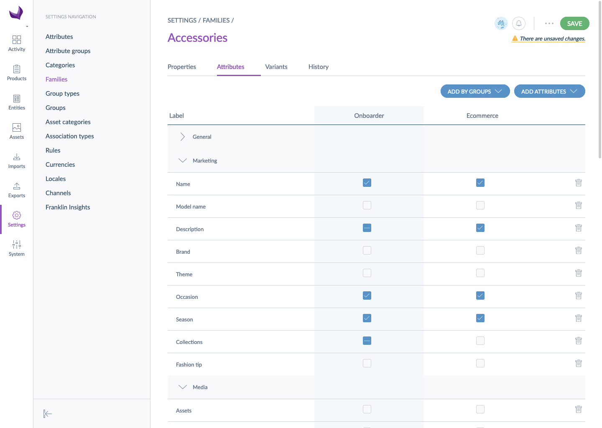

# Define the product information to collect

The goal of the Onboarder is to save time during product collection from the suppliers. The idea is not for you to manipulate product data but to receive structured data. To do so, you will be able to define the attributes you expect your suppliers to fill in for each family. The requirements for your suppliers will be defined like any other PIM channel.

As soon as an Onboarder is installed alongside an Akeneo PIM, a new channel  called `Onboarder` is automatically added to your PIM. Thanks to this channel, you will be able to define the attributes you want your suppliers to complete. All attributes defined as required or nice to have in a family for the `Onboarder` channel will be sent to the relevant Supplier Onboarder. For each family, the attributes sent to the Supplier Onboarder are the following:

* attribute used as label
* attribute used as the main picture
* attribute used as identifier
* required attributes
* nice to have attributes

:::info
The attribute used as identifier will be displayed in read-only in the Supplier Onboarder.
:::

::: success
Only the attributes marked as 'required' are taken into account for the completeness of products. The nice to have attributes are not mandatory to synchronize the product.
:::

::: warning
Custom attributes are not supported by the Onboarder and suppliers are not able to enrich custom attributes data.
:::

::: warning
When you [create a supplier](/onboarder/articles/create-supplier.html), you can choose to allow them to create products.
In order to avoid conflict of data, the Onboarder blocks the **creation** of product models and variants by suppliers but you can still [assign them variants](/onboarder/articles/define-product-supplier.html).
:::

## Via flat files import

Use the family import profile to set the family requirements, learn how to [run an import](https://help.akeneo.com/articles/imports.html#run-an-import) in this dedicated article.

## Via the User Interface

Like for any other PIM channel, you can easily define requirements in the family settings. Need a hand to handle it? Read our article on how to [set an attribute as required for a channel](https://help.akeneo.com/articles/manage-your-families.html#set-an-attribute-required-for-a-channel).
