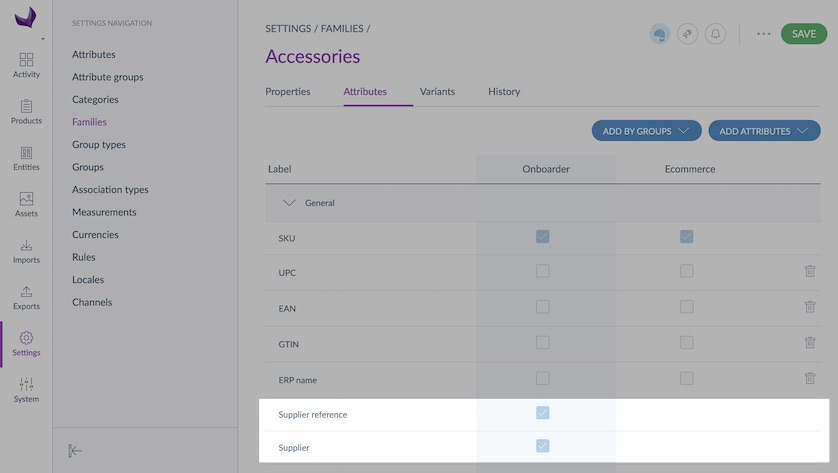
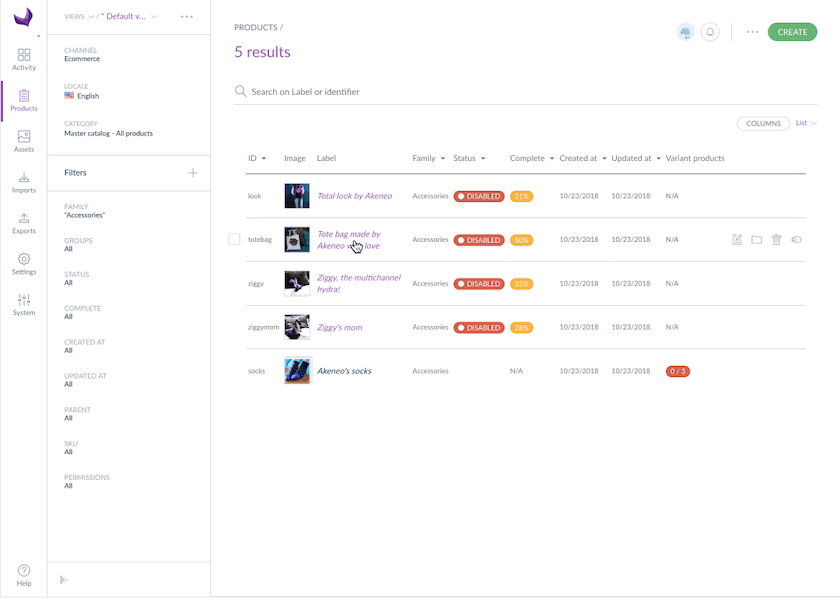

# A few things to know before starting

When the Onboarder bundle is installed on the PIM, 2 new attributes are automatically added on the Onboarder channel to all your products: `Supplier` and `Supplier reference` . By assigning a supplier to a product and defining the product supplier reference, this product will automatically be sent to the relevant Onboarder Supplier.

:::info
You can link a product to a single supplier.
:::

:::info
Both supplier and supplier reference are mandatory for a product to be sent to the relevant Supplier Onboarder.
:::

# Via flat files import

`Supplier` and `Supplier reference` columns have been added to the product import profile for both CSV and XLSX profiles so you can easily add a supplier to a product.
Do not hesitate to have a look at [this article](https://help.akeneo.com/articles/product-export-builder.html#mainContent) to export products.

# Via the User Interface

It's really easy to assign a supplier to a product:
1. Log in your PIM
1. Select a product in the Product grid
1. Look for the `Supplier` attributes
1. Click on the dropdown
1. Select the supplier name you want to add
1. Click on `Save`
