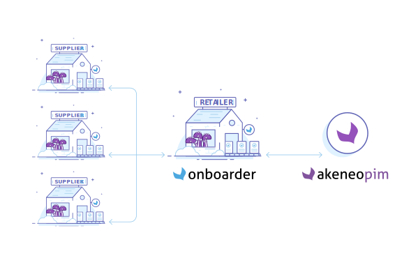

# Onboarder? What's that?

The Onboarder is a platform which will help you to collect more easily and more quickly product data coming from your suppliers and to review the information they filled in. It is composed of 3 modules:
- the PIM
- the Retailer Onboarder
- the Supplier Onboarder

Your PIM structure will be used to define the information you want to get from your suppliers. Thus, you don't have to manipulate their data to make them match your catalog modelization.
