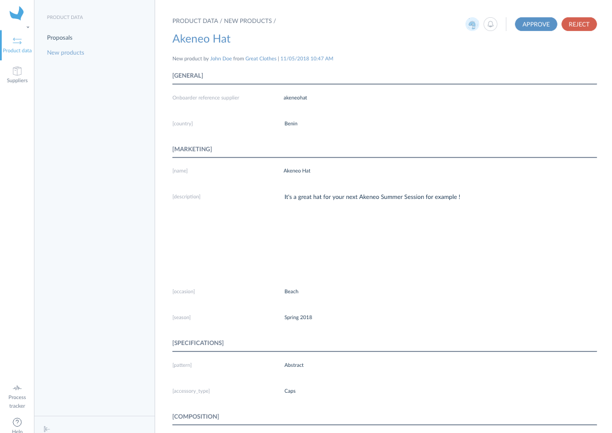
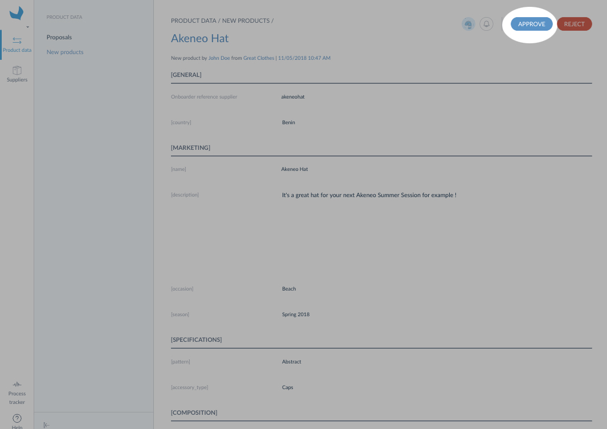
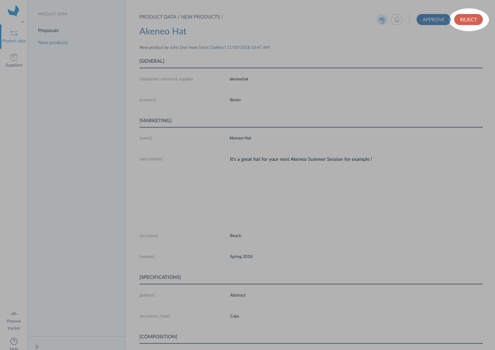

# Display product suggestions list

The supplier has the ability to suggest new products directly from the Supplier Onboarder if the [option *allow product creation*](./manage-supplier.html#create-suppliers) is enable. These new product suggestions are not part of your Akeneo PIM catalog until you accept them.

:::info
Suppliers **cannot** create product models and variants.
:::

You can easily display them by following these steps:
1. Log in your Retailer Onboarder
1. Click on Product data / New products

A new screen will be prompted with all the product suggestions.

:::info
If the suggestions grid is empty, this means that your suppliers didn't or cannot create product suggestions in their Supplier Onboarder or that you are not the "Retailer referent" for this supplier.
:::

# Display product suggestion details

To have a look at the product suggestion details you can click on it. It will be prompted in a form and all its attributes will be displayed in read-only.

# Review product suggestions
## Accept a product suggestion

If you want to accept a product suggestion:
1. Click on `Accept`,
1. Then, you are asked to fill in the product identifier and its category,
1. Click on `Save`.

Once you accept a product suggestion the supplier sees the [suggestion status](../articles/suggest-new-products.html#follow-your-product-suggestions) changed to `In Catalog`. You can now review its attributes values in the [Akeneo PIM proposals](/onboarder/articles/review-product-changes.html).

:::info
As long as you don't accept the proposals for an accepted product suggestion, the content of this product won't appear in your Akeneo PIM.
:::

:::info
New assets suggested by suppliers are included in the new product and they are automatically added to the right asset collection when the new product is accepted. You can [edit the asset attributes](https://help.akeneo.com/pim/serenity/articles/manage-asset-families.html) afterward.
:::

## Reject a product suggestion

If you need to reject a product suggestion, you just need to click on `Reject`. Then, the supplier will see this product with the suggestion status `Suggested` and the enrichment status `Rejected`.

