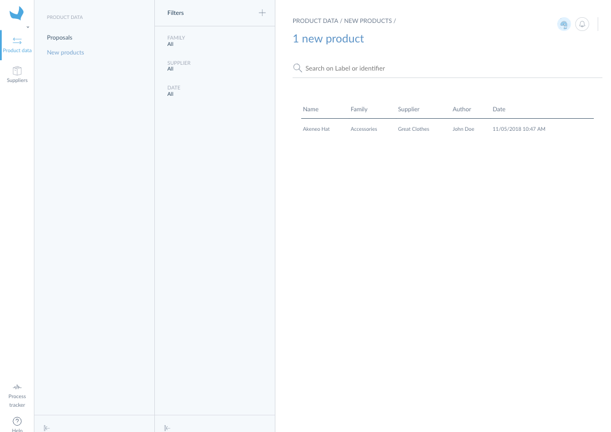
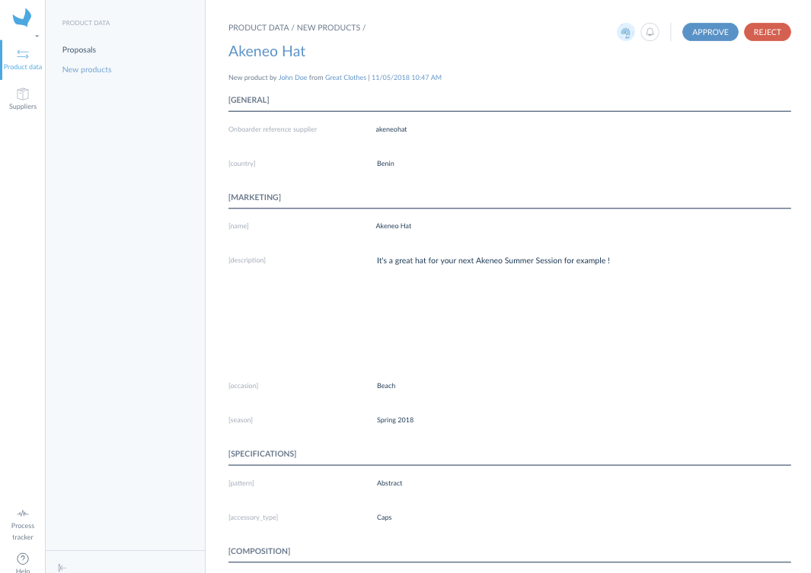
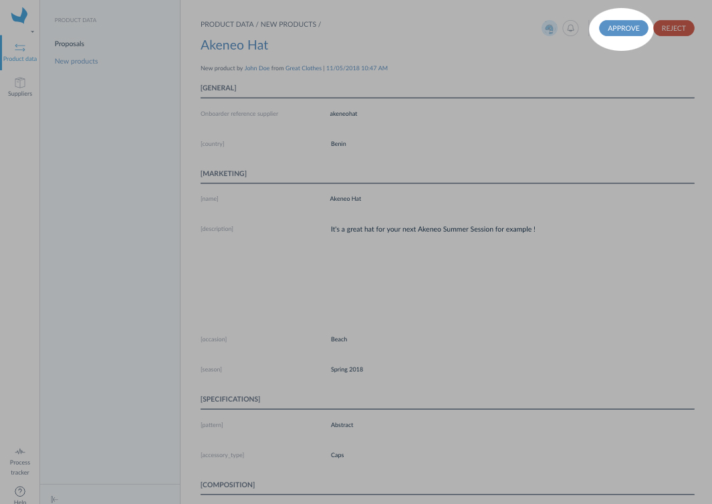
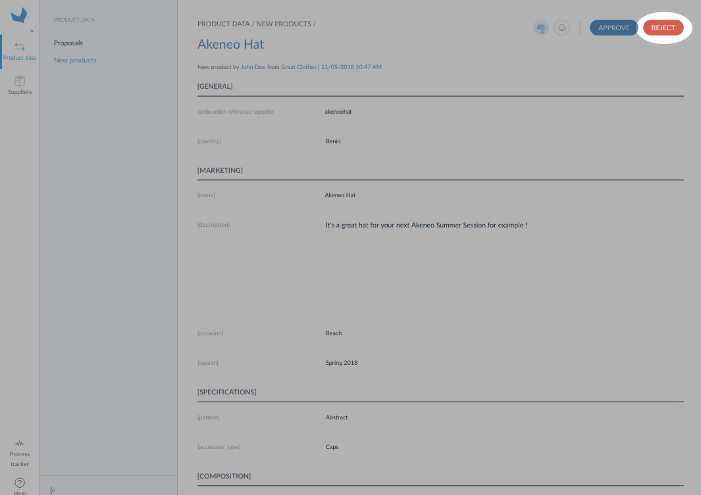

# Display prereferenced product list

The supplier has the ability to create prereferenced products, nice, but what is it? A prereferenced product is a product created in the Supplier Onboarder by one of your supplier. These new products can be interesting for you to enlarge your product range or to launch a new collection.

You can easily display them by following these steps:
1. Log in your Retailer Onboarder
1. Click on Product data / New products

A new screen will be prompted with all the prereferenced products.

:::info
If the prereferenced grid is empty, this means that your suppliers didn't create products in their Supplier Onboarder or that you are not the "Retailer referent" for this supplier.
:::

# Display prereferenced product details

To have a look at the prereferenced product details you can click on it. It will be prompted in a form and all its attributes will be displayed in read-only.

# Wanna approve a prereferenced product?

If you want to accept a prereferenced product, simply:
1. Click on the `Accept` button
1. A pop-in is prompted to fill in the product identifier and its category
1. Click on `Save`

You're done with the first part: you accepted the prereferenced product. You can now review its attributes values in Product data / Onboarder proposals.

:::info
As long as you don't validate the proposals for an accepted prereferenced product, it won't appear in your Akeneo PIM.
:::

:::info
New assets suggested by suppliers are sent in proposals and they are automatically added to the right asset collection when the new product is accepted. You can [change the asset](https://help.akeneo.com/pim/serenity/articles/manage-asset-families.html)(label, other attributes).
:::

# Or do you prefer to reject it?

If this prereferenced product has little interest for the moment, you can refuse it by clicking on the `Reject` button on the top right corner of the prereferenced product form. The Supplier will be notified of your review and the mention `Rejected` will be displayed in the Product form header in his User Interface.
