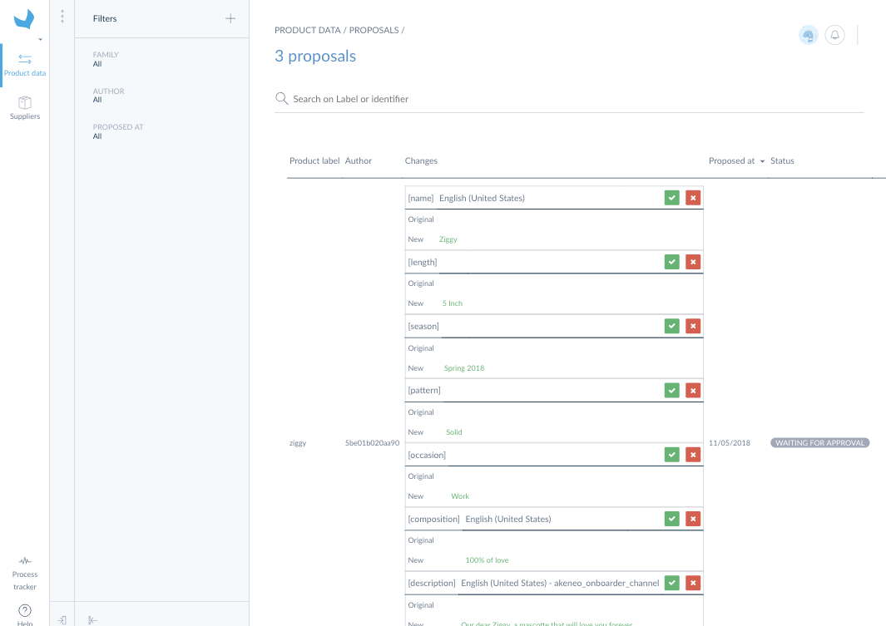

# How to manage suppliers proposals?

As soon as a product will be completed on the Supplier Onboarder (aka all the attributes you defined as required for the channel Onboarder are filled in by the supplier) it will be sent to your Retailer Onboarder so that you can review it.

:::info
A product updated by one of your supplier will never impact directly your PIM. A review step is mandatory so that you can evaluate the proposition.
:::

To display these changes you can:
1. Log in your Retailer Onboarder
1. Click on `Product data`
1. Then on `Onboarder proposals`

The proposals provided by your suppliers will be displayed.

If you are not yet familiar with the proposals review, you can learn in [this article](https://help.akeneo.com/articles/review-products-proposals.html#review-actions-on-proposals) how to work with them.

:::info
Only the proposals made by your suppliers in their Onboarder will be displayed in this screen. The proposals provided in the PIM are still displayed in the PIM in `Activity`/ `Proposals`.
:::

:::info
New assets suggested by suppliers are sent in proposals and they are automatically added to the right asset collection when the proposal is accepted. You can then set a label to the asset or change other attribute of the asset like described into [this article](https://help.akeneo.com/pim/serenity/articles/manage-asset-families.html).
:::
