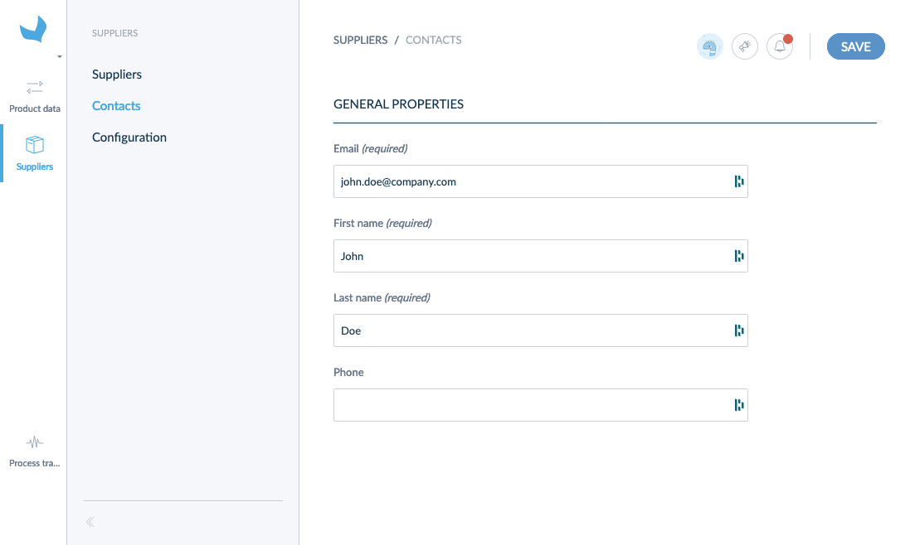

# Enjoying flat files?

You can use `CSV` or `XLSX` files to import suppliers contacts. The expected header of your supplier contacts import file is the following:
* email: supplier referent email (required)
* last_name: supplier contact's last name (required)
* first_name: supplier contact's first name (required)
* phone: supplier contact's phone number

Here are the steps to create suppliers contacts via import:

1. Log in your Retailer Onboarder
1. Click on `Suppliers` then on `Contacts`
1. Select `CSV` or `XLSX`
1. Click on `Upload a file`
1. Drag your file in the drop area or browse disk
1. Click on `Upload and import now`
1. The process tracker page is prompted. You can follow the progress of the import

When it is finished your suppliers are created and displayed in the contacts grid

# Or User Interface addict?

If you prefer using the User Interface, you can follow these steps to create a supplier:

1. Log in your Retailer Onboarder
1. Click on `Suppliers` then on `Contacts`
1. Click on the `Create` button
1. Fill in the required information (see contact definition to learn more about the expected properties)
1. `Save`

Your suppliers' contacts are created! Keep in mind you can create up to 3 contacts per supplier.

::: info
Pay attention to the email you set for the contact; it will be used to send the invitation link to log in the Supplier Onboarder.
:::
