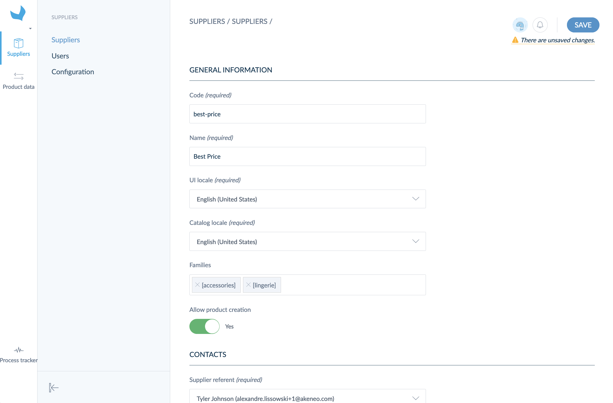

There are two ways to create suppliers into the Onboarder:

# Use flat file imports

You can use `CSV` or `XLSX` files to import suppliers. The expected headers of your supplier import file are the following:
* _code_: code of the supplier (required)
* _name_: name of the supplier (required)
* _supplier_contact_emails_: supplier referent email, separated by comas (required)
* _retailer_contact_usernames_: main username(s) in charge of this supplier, separated by comas (required)
* _catalog_locales_: locale codes, separated by comas (required)
* _user_default_locale_: user interface locale (required)
* _families_: family codes, separated by comas (required)
* _allow_product_creation_: boolean 0 = No and 1 = Yes (optional)

::: warning
Formerly the column _supplier_contact_emails_ was named _supplier_referent_email_. To continue using the same import file you were using, you must change this column header.
:::

Then you can create your suppliers with the file you built by following these steps:
1. Access to your Onboarder from the PIM,
1. Click on `Import` on the Suppliers page,
1. Select `CSV` or `XLSX`,
1. Click on `Upload a file`,
1. Drag your file in the drop area or browse disk,
1. Click on `Upload and import now`.

You are redirected to the Process tracker page, where you can follow the import progress.

When finished, your suppliers are created and you can see them in the suppliers' grid.

::: info  
When you create a supplier, the linked user receives a welcome email.
:::

::: warning
The suppliers cannot create product models and variants. You'll need to [link them with each product variant](/onboarder/articles/define-product-supplier.html).
:::

# Use the interface

Otherwise, you can directly create and edit the supplier into the interface by following these steps:
1. Access to your Onboarder from the PIM,
1. Click on `Suppliers`
1. Click on `Create`
1. Fill in the required information (see supplier definition to learn more about the expected properties)
1. `Save`

Your suppliers are created.

