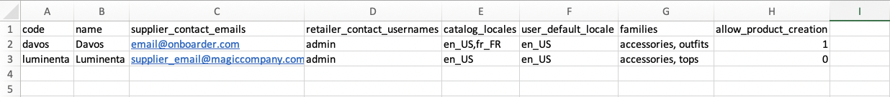
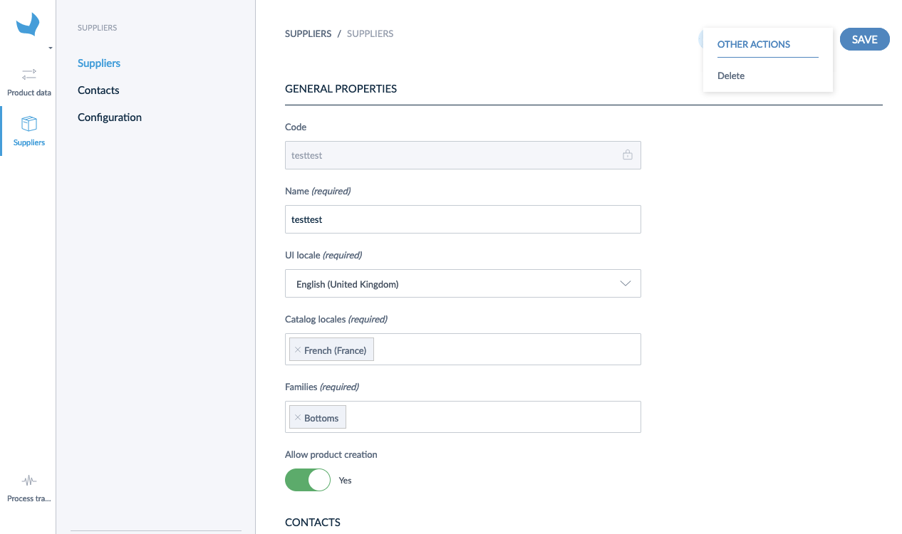
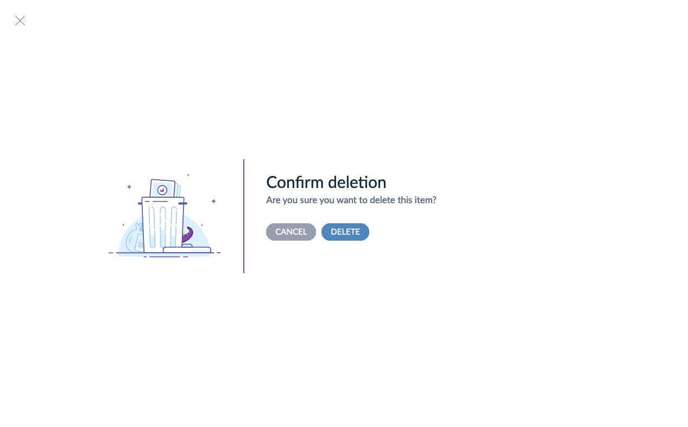

# Create suppliers

There are two ways to create suppliers in Akeneo Onboarder:
1. Fill in the supplier form,
1. Import a flat files.

When creating a supplier, you must provide the following information:

| Name | Code | Definition | Requirement |
|---|---|---|---|
| Supplier code | _code_ | The code of the supplier | Required |
| Supplier name | _name_ | The name of the supplier | Required |
| Supplier contact emails | _supplier_contact_emails_ | List of supplier contact emails | Required |
| PIM user(s) | _retailer_contact_usernames_ | List main PIM user(s) in charge of this supplier | Required |
| Catalog locales | _catalog_locales_ | List all catalog locales you want your supplier to enrich | Required |
| Default locale for display | _user_default_locale_ | The default locale to display the interface. _The supplier user can change it afterward._ | Required |
| Families | _families_ | List all families the supplier can enrich | Required |
| Product creation | _allow_product_creation_ | Toggle to authorize product creation by the supplier. | Optional |

Once you've created the suppliers, you can directly see them in the suppliers' grid.

For example, your excel file could look like this :

::: info  
When you create a supplier, the supplier contact user receives a welcome email.
:::

::: warning
The suppliers cannot create product models and variants. You'll need to [link them with each product variant](/onboarder/articles/define-product-supplier.html).
:::

## Use the interface

::: info
Before creating a supplier, make sure you already created the supplier contact users associated to it.
:::

You can directly create and edit the supplier from the interface by following these steps:
1. Access your Onboarder from the PIM,
1. Click on `Suppliers`
1. Click on `Create`
1. Fill in the required information (see supplier definition to learn more about the expected properties)
1. `Save`

Your supplier is created.

## Use flat-file import

You can also use `CSV` or `XLSX` files to import suppliers.
You can download a template containing the header with the code for each column.

When you fill in the _supplier_contact_emails_, _retailer_contact_usernames_, _catalog_locales_, _families_, columns the values must be separated by comas.

And the _allow_product_creation_ column is boolean with 0 for _No_ and 1 for _Yes_.

::: warning
Formerly the _supplier_contact_emails_ column was named _supplier_referent_email_. To continue using the same import file you were using, you must change this column header.
:::

Then you can create your suppliers with the file you completed by following these steps:
1. Access your Onboarder from the PIM,
1. Click on `Import` on the Suppliers page,
1. Select `CSV` or `XLSX`,
1. Click on `Upload a file`,
1. Drag your file in the drop area or browse disk,
1. Click on `Upload and import now`.

You are redirected to the Process tracker page, where you can follow the import progress and your suppliers are created.

# Delete supplier
During your use of Onboarder, you may need to delete suppliers for different reasons. There are two ways to proceed:
- From the supplier page

- From suppliers list

In both cases, you'll need to confirm this action.

Once you choose to delete a supplier, there are several consequences you should be aware of:
1. All the supplier users connected to this supplier will be unlinked from it and will no longer have access to Akeneo Onboarder,
1. The _supplier_ and _supplier ref_ of products that are assigned to the deleted supplier will be purged at the same time,
1. All data stored in Akeneo Onboarder will be deleted (products, their values and assets). Make sure they completed all required data, and you have it into the PIM before you proceed to deletion.

::: warning
If, after some time, you decide to create a supplier that has been previously removed, the data won't be recovered as a new supplier will be created from scratch.
:::
