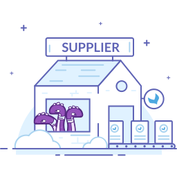

# Did you say "Supplier"?

A supplier is one of your business partner. You buy him products to expand your product range. In the Onboarder it is an entity with the following properties:

| Property | Definition | Comment |
|---------------|--------------|--------------|
| Code | A unique code that identifies your supplier  | Allowed characters: lowercase letters, figures and "-". Its length cannot exceed 50 characters|
| Name | Supplier company name |
| UI locale | The language of the Supplier Onboarder interface | Among the PIM locales |
| Catalog locales | The locales used in the Supplier Onboarder for product data | Among the activated Onboarder channel locales |
| Families | The families the supplier can work with |
| Allow product creation | Allow the supplier to create new products or not| By default suppliers can create new products. In any case, the suppliers cannot create product models and variants |
| Supplier referent | The supplier user who will receive the invitation email to log in the Onboarder |
| Retailer referent | The PIM user who will be notified when a product is created in the Supplier Onboarder |
