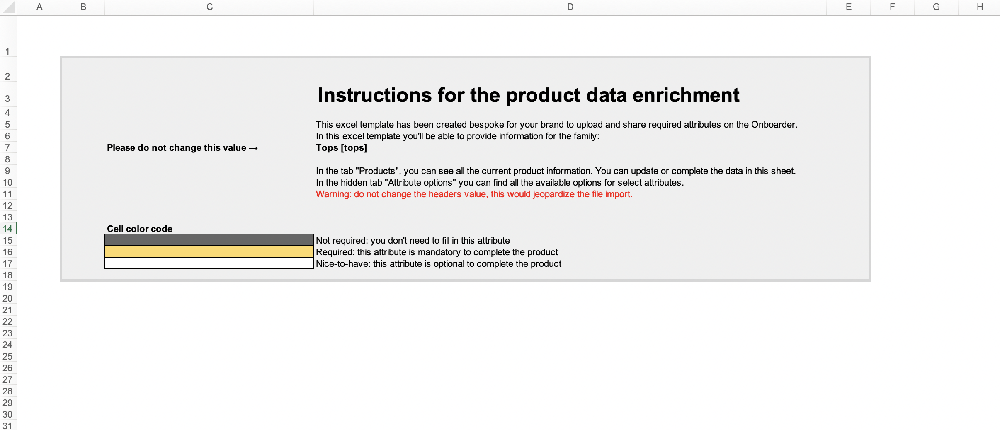
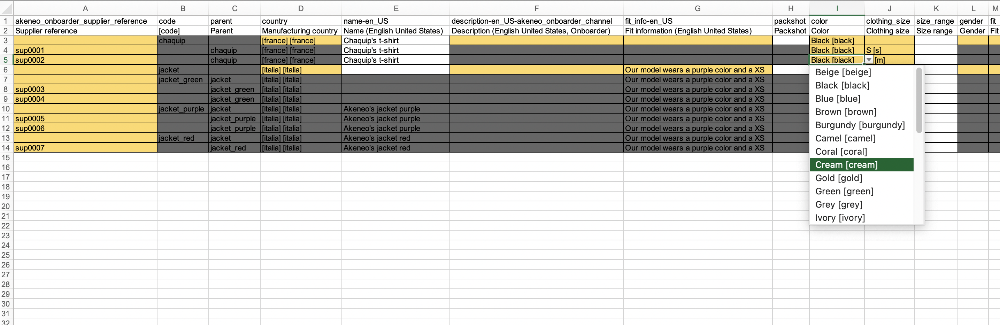
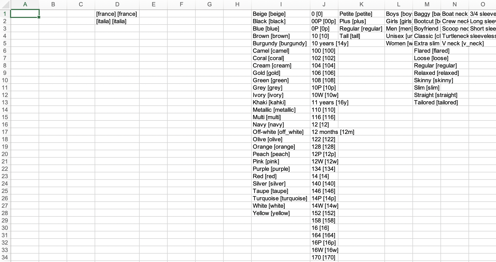

# Export your products in an excel sheet
Akeneo Onboarder allows you to enrich products directly from the portal, but we also wanted to keep the possibility for you to use excel files.
With a simple click on `Export All`, you can download all the product data stored in Akeneo Onboarder.

Once you launch the export, you see a notification with a link to the Process tracker to find the latest export.
You can click on `Download Generated files` when the export job ends.
Then, you have a choice to download the excel file corresponding to one product family or to download one archive with all excel files.

# Enrich your product data
Each excel file is specific to one product family, always containing three sheets.
::: info
You can also find the name of the product family in the excel file name.
:::

## Instruction sheet

This is the first sheet you can see. It gathers all instructions you need to understand how to use the excel file.
In this sheet, you can find the **name** and code of the product family for this file.
You also find the color code of cells in the product sheet. These colors will help you fill in the mandatory or optional attributes for products, product models, and variants.

## Products sheet

Then, you have the essential page: **the products sheet**.

On this page, you'll find all the products, product models, and variants belonging to one product family.
The sheet is composed of:
* a two rows header,
* list of products

The header contains the code (1st row) and the label (2nd row) of each attribute of the product family in the catalog locale **_TO CHECK_** you used for export.

The first columns are locked to help you find your products in this sheet. The columns are:
* _akeneo_onboarder_supplier_reference_ that is the reference of your product in Akeneo Onboarder,
* _code_ that is the parent code of one [product model](../articles/what-about-products-variants.html),
* _parent_ that is the [product model](../articles/what-about-products-variants.html) code.
All other columns are displayed in the same order that the product page in Akeneo Onboarder.

Thanks to the color code, you can see if the attributes are mandatory or optional for the products you'll enrich.

::: warning
As explained in [this article](/onboarder/articles/suggest-new-products.html), as a supplier, you're not allowed to create product models or variants in Akeneo Onboarder.
:::

::: info
You can use this excel file to [create new product suggestions](/onboarder/articles/suggest-new-products.html) by filling the _akeneo_onboarder_supplier_reference_ and the required columns for a simple product.
:::

## Attribute options sheet

This sheet provides the list of all available options for attributes that are single selects or single reference entities in the [products sheet](#products-sheet). In the product sheet, the attributes are shown in the columns.

::: warn
Do not edit the values in the options sheet; otherwise, the import won't work.
:::

<!-- TO UNCOMMENT WHEN UPLOAD AVAILABLE
# Upload the new product data

You must import the same file to update your products with the new values in the excel file. That's it.
In the Process tracker, when the upload is finished, you can see the number of updated products and skipped ones. You also get details on all errors if there are some.

-->
