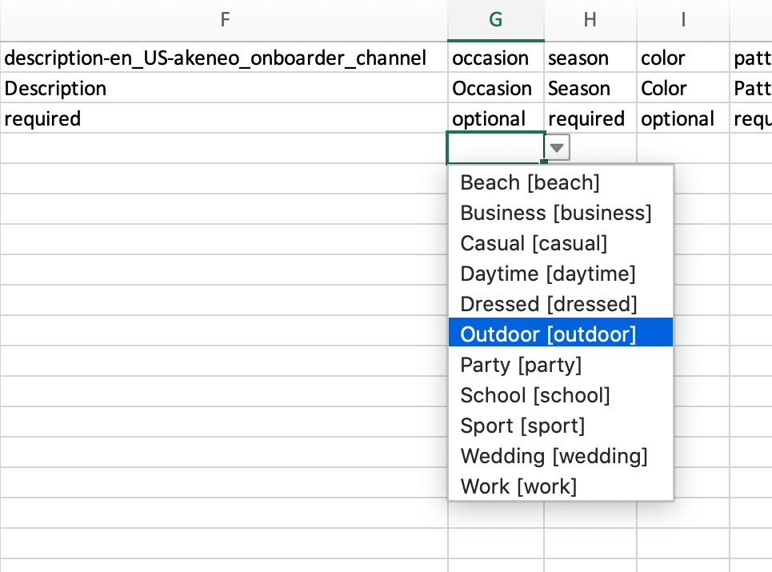

# Export your products in an excel sheet
Akeneo Onboarder allows you to enrich products directly from the portal, but we wanted also to keep the possibility for you to use excel files.
With a simple click on `Export All`, you can download all the product data stored in Akeneo Onboarder.

Once you launch the export, you see a notification with a link to the Process tracker to find the latest export.
When the export job ends, you can click on `Download Generated files`.
Then, you have a choice to download the excel file corresponding to one product family or to download one archive with all excel files.

# Enrich you product data
Each excel file is specific to one product family, and they always contains three sheets.
::: info
You can also find the name of the product family in the excel file name.
:::

## Instruction sheet

This is the first sheet you can see. It gather all instructions you need to understand how to use the excel file.
In this sheet, you can find the **name** and code of the product family the file is dedicated to.
You also find the color code of cells in the product sheet. These colors will help you to fill in the mandatory or optional attributes for products, product models and variants.

## Products sheet

Then, you have the most important page: **the products sheet**.

In this page, you'll find all the products, product models and variants belonging to one product family.
The sheet is composed of:
* a 2 rows header,
* list of products

The header contains the code (1st row) and the label (2nd row) of each attribute of the product family in the catalog locale **_TO CHECK_** you used for export.

To help you find your products in this sheet, the first columns are locked,  
* _akeneo_onboarder_supplier_reference_ that is the reference of your product in Akeneo Onboarder,
* _code_ that is the parent code of one [product model](../articles/what-about-products-variants.html),
* _parent_ that is the [product model](../articles/what-about-products-variants.html) code.
All other columns are displayed in the exact same order that the product page in Akeneo Onboarder.

Thanks to the color code, you can see if the attributes are mandatory or optional for the products you'll enrich.

::: warning
As explained in [this article](/onboarder/articles/suggest-new-products.html), as a supplier you're not allowed to create product models or variants in Akeneo Onboarder.
:::

::: info
You can use this excel file to [create new product suggestions](/onboarder/articles/suggest-new-products.html) by filling the _akeneo_onboarder_supplier_reference_ and the required columns for a simple product.
:::

## Attribute options sheet

This sheet provide the list of all available options for attributes that are single selects or single reference entities in the [products sheet](#products-sheet). In the product sheet, the attributes are resprented in column.

<!-- TO UNCOMMENT WHEN UPLOAD AVAILABLE
::: warn
Do not edit the values in the options sheet, otherwise the import won't work.
:::

# Upload the new product data

-->
# Plain template
## Where can I find it?

In order to have an easy way to import your products in your Onboarder, you can download a template matching your families. Those templates provide all the attributes in a format that your Onboarder will accept.

Here is how to get them:
1. Log in your `Supplier Onboarder`
1. Click on the `Download` icon on the top right corner of the product grid
1. Choose your preferred format: one file per family or one file with all families, in `CSV` or `XLSX`

This template file can easily be imported in your Onboarder to add many products at once.

## File format
The template contains 3 lines in the header:
1. attribute code: Unique attribute identifier. Allows the Onboarder to know to which attribute the data refers to when importing.
1. attribute labels: Human-readable designation of the attribute code above given by your retailer.
1. requirement status of the attribute: Shows you the status of the attribute (required, optional) for the [product completion](update-products.html#the-attribute-panel)

:::warning
Only line bellow the third line will be read at import. If you change the file and add products before this line, they won't be imported.
:::

:::info
The excel file (XLSX) contains drop-down for single select attributes. Each selection option is displayed with the option label and the option code between brackets. As for the attribute code line, the option code is necessary to read the file during import.  
:::

