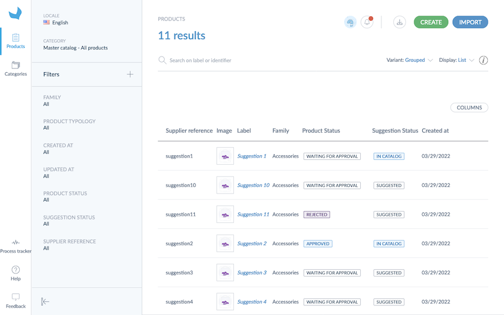

As a supplier, you may want to _suggest new products_ to your retailer or distributor.
Once they enable the option on their Akeneo PIM, you'll be able to see the `Create` button on the top right of the product grid.

There are 2 ways to create new product suggestions:
* manually
* with imports

# Create product suggestions
## Manual creation

In order to create a new product on the Onboarder, you just have to:
1. Click on the `Products` menu
1. Click on the `Create` button on the top right corner of the product grid. A creation wizard appears.
1. Specify the unique product identifier (SKU)
1. Fill out the name of the product (optional)
1. Select a family for the new product
1. Hit `Save`.

Your product is now created and its form is displayed. You can start filling its attributes.

:::info
A new product cannot be created without a family. The family depicts all the product attributes that need to be sent to your retailer or distributor.
The family list will give you access to all the product families you can create in your Onboarder. This list is maintained by your retailer or distributor.
:::

:::info
Product creation works the same way as in the PIM, learn more about it by reading our [Create a product](https://help.akeneo.com/articles/create-a-product.html#create-a-product) article.
:::

::: warning
As a supplier you cannot create [product models and variants](/pim/serenity/articles/what-about-products-variants.html). Please contact your retailer or distributor to enrich product models and variants.
:::

## Speed up with import
Now, you know how to create a new product manually, you may think there should be a faster way to do it.

The answer is yes!

You can run an import and it's very easy.
On your grid:
1. [Download a product import template](/enrich-with-excel-files.html),
1. Complete the spreadsheet,
1. On the product grid, click on the `Import` button,
1. Drag and drop your file,
1. Run the import and
1. Wait for the notification

# Follow your product suggestions
Once you suggest a new product, its *suggestion status* is `Suggested`.
Then, your retailer or distributor needs to accept your product suggestions to added to its catalog.

For more transparency on products, Akeneo Onboarder shows the products that are part or not of your retailer or distributor catalog.
Actually, you can see a `Suggestion Status` column on the product grid and on the top of the product page.

After being integrated to the catalog, the suggestion status of your products is `In Catalog` and the products follow the [enrichment statuses](./supplier-synchronization.html#simple-and-transparent-statuses).

