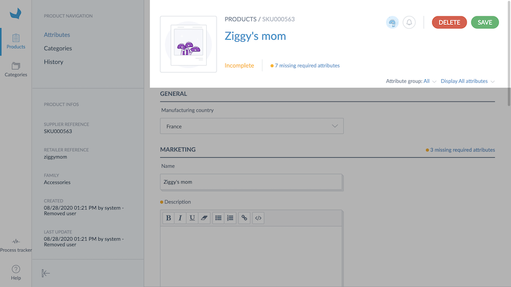

# Via the User Interface
Once you open the Onboarder, the first screen you can see is the [product grid](/onboarder/articles/products-grid-supplier.html), then you can open products you need to enrich.

The product form contains 4 parts:
* The header panel
* The product navigation panel
* The meta data panel
* The attribute panel

## The header panel

The header panel shows the following product information:
* The product name
* An image of the product (if available)
* The [status](./supplier-synchronization.html#simple-and-transparent-statuses) _(not yet available on product model levels)_
* A menu to select the [locale](https://help.akeneo.com/pim/serenity/articles/what-is-a-locale.html) to complete
* A breadcrumb to navigate within the [product model and variants](https://help.akeneo.com/pim/serenity/articles/what-about-products-variants.html)
* The number of missing attributes
* Some filters to directly access attribute groups or missing attributes

:::info
The breadcrumb is displayed only when you are on a product model page, it allows you to navigate through the different levels of the product model.
:::

## The product navigation panel

The product navigation panel allows you to switch between different sections of your product:
* [Attributes](/onboarder/articles/update-products.html#the-attribute-panel): Displays the list of attributes of a product. This section is used to enrich your product. This is the most used view.
* Assets: Allows you to upload media files when required. This section is only displayed if assets are required to complete the product.
* Categories: Allows you to categorize your product.

## The meta data panel

The meta data panel displays information regarding your product such as:
* The family of your product
* The creation timestamp
* The last update timestamp

## The attribute panel

The attribute panel displays all the attributes you can enrich in the Onboarder. This list is defined by the retailer.

### Completeness
All the attributes marked with the yellow bullet point are required for the retailer.

The attributes without the bullet point are optional and are not taken into account for the product status calculation. When you complete these attributes, you help the retailer to get better product values.

:::warning
As soon as a product is complete for one locale, it is [automatically sent](/onboarder/articles/supplier-synchronization.html) to the Retailer Onboarder to be reviewed.
:::

:::info
The statuses for product models are only calculated on product variants.
Statuses for product model levels are not yet available, we are working on it. 
The breadcrumb shows the number of complete product variants. You can see more details by clicking on the breadcrumb.
:::

# Via flat file upload
By using the Onboarder, you also have the possibility to [download a template](/onboarder/articles/dwl-product-import-tpl.html) in csv or xlsx format and upload it once you have completed it.
